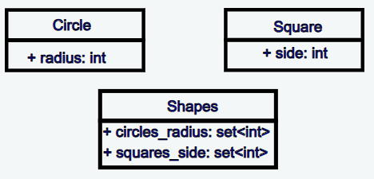

Advanced Modern C++ Udemy Course Coding assignment solutions written by me.

URL: https://www.udemy.com/share/1020JG3@pJfSqQ9hFoQhotKsuF5kiqqwx74BBBARE2WixDIhT132FWCMWu_LDcyh0s7hlJj9/

## Examples:

### 1- Class Definition

A simple C++ class represents a URL, such as "http://www.example.com/index.html".

The class has two members of type std::string. One member stores the protocol of the URL (the "http" part) and the other stores its resource (the "www.example.com/index.html" part which comes after the separator).

Questions for this assignment
Define the class.

Write a constructor for the class which takes the protocol and resource as arguments.

Add a member function to the class which displays the complete URL: the protocol, followed by the separator, followed by the resource. For example, "http://www.example.com/index.html"

Write a program to test your class. This program will create an object of the class, then call its member function to display the complete URL.

### 2- String manupilation

Write a function called exclaim(). This function takes an std::string as argument and returns an std::string.

The function will return the argument string, but with all the punctuation characters replaced by an exclamation mark.

For example, if the argument string is

"To be, or not to be, that is the question:"

The returned string will be

"To be! or not to be! that is the question!"

Use a suitable character function to implement this function.

### 3- File Operations

You are given the attached languages.txt file and the following type definition:

struct language {
string lang;
string designer;
int date;
};

The format of the languages.txt file is:

C++ Stroustrup 1979
Java Gosling 1991
Write a program which will:

Read in the data from the attached languages.txt file

Use each line of input to populate a language object

Add this object to a vector

Print out all the data in the vector, separated by commas

Your output should look like this:

C++, Stroustrup, 1979
Java, Gosling, 1991

### 4- Lambda Expression

Write a function that takes a vector of int as argument and uses a range-for loop to print out the elements of the vector.

Write a program that calls this function. Check that your program compiles and runs correctly.

Modify your program so that it sorts the elements in descending order, with the largest element first. For example, if the vector elements are 1, 2, 3, 4, 5, the result would be 5, 4, 3, 2, 1.

Use a suitable standard algorithm with a lambda expression as predicate.

Display the elements of the vector after sorting them. Check that your program still compiles and runs correctly.

## 5- Sequential Containers

Write a program which will Reads strings entered by the user Store them in a sequential container print out the strings in the order they were entered.

Implement this program using std::vector to store the strings. Check that your program compiles and runs correctly.
Implement this program using std::list to store the strings. Check that your program compiles and runs correctly.
Implement this program using std::deque to store the strings. Check that your program compiles and runs correctly.
Change the list and deque versions so that they store the strings in reverse order.
Do not perform any manipulation on the container elements.

## 6- Sequential Containers - Part 2

This assignment will use the URL class you wrote for the "Classes and Strings" assignment.

Or you can use the solution for that assignment, which is in the attached ZIP file.

Questions for this assignment
Add a member function to the URL class which returns the URL as an std::string (e.g. "http://example.com/index.html")

Write a class which uses an STL container to store objects of your URL class. New objects are added at the front of the container.

Only add a URL object if the URL is not already in the history. If the URL is already present, move it to the front of the container.

Write a program to test your class. Check that your program compiles and runs correctly.

## 7- Maps

You will write a program that:

Reads words entered by the user stores the value and length of each word in a suitable std::pair stores the pair object in a container

Prints out all the elements of the container

Implement this program, using std::vector to store the pair objects.

What do you notice about the output?

Implement this program, using std::map to store the pair objects.

What do you notice about the output?

Explain your results.

Run your programs again, but this time enter some duplicate words.

## 8- Virtual Function

Write an inheritance hierarchy with three classes: Base, Child and Grandchild. Do not define any constructors or data members for these classes.

Child inherits from Base and Grandchild inherits from Child.

Give each class a print() member function which prints out the name of the class

Write a print_class() function which takes a Base argument by value

Create an object of each class and pass it to a call to print_class()

Implement the program as described. Explain your results.

Change the print() member function to be virtual.

Run the program again and explain your results.

Change print_function() so that its argument is passed by reference.

Run the program again and explain your results.

Add an integer member to the Base class. Give the Base class a constructor which initializes this member from its argument.

Change the program so that the Base, Child and Grandchild objects are created using this argument.

Why does the program not compile?

What is the best way to solve this problem?

## [Addiational Example 1 from Hackerrank] Adding Shapes Example

Implement 3 classes: Shapes, Circle, and Square. Class Circle contains a public variable radius. Class Square contains a public variable side. Class Shapes holds multiple circles and squares. It includes: - set<int> circles radius: the radii of the circles it holds - set<int> squares side: the sides of the squares it holds
Overload the addition operator on class Shapes, where adding any objects of the Square or Circles classes results in a new object of class Shapes with all the shapes data included. Please refer to the example.

## [Addiational Example 2 from Hackerrank] Single Instance

Implement a class Singlelnstance, which contains an integer variable value with a getter and setter for the same. It should have the property that prevents the creation of more than 1 instance of the class at any time. Another instance can be created when the previous one is deleted. If an attempt is made to create a second instance, it class should throw an exception with the message "Couldn't create more than 1 instance of SingleInstance".
Note - The getter and setter should have the names getValue and setValue, respectively. If there is an attempt to create a copy of the instance via the copy constructor, the class should throw the same exception.
For Example, value = 2,
SingleInstance \*instance1 = new SingleInstance();
instancel->setValue(2);
fout << instancel->getValue() << "\n";

## [Addiational Example 3 from Hackerrank] Matrix Sum

A function that reads matrices from input and prints their sum.

## [Addiational Example 4 from Hackerrank] Calculate the minimum and maximum sums of a vector of integers.

## [A Question from InterviewBit] Find majority element

Given an array of size N, find the majority element. The majority element is the element that appears more than floor(N/2) times.
You may assume that the array is non - empty and the majority element always exist in the array.
